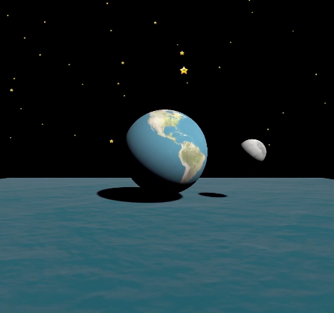

# Three.js Solar Scene

This project is a 3D solar scene built with [Three.js](https://threejs.org/). It features a rotating Earth-like sphere, an orbiting moon, a textured plane, and a starry background. Shadows and lighting effects are included to enhance realism.

**NOTE!**: This project was written entirely using Copilot Edits! There are stupid project structure decisions that I've left intact since it mirrors how it was generated by the tool.

📹 **Watch the live stream recording of this project being written in real-time**: [YouTube Video](https://youtu.be/4wdohdcPOT8)

## Features

- **Earth-like Sphere**: A textured sphere that rotates and gently moves up and down in a sine wave motion.
- **Moon**: A smaller textured sphere that orbits the Earth-like sphere and rotates in the opposite direction.
- **Textured Plane**: A plane beneath the spheres with a water-like texture.
- **Stars**: A dynamic starry background with twinkling effects.
- **Lighting and Shadows**: Directional lighting simulates sunlight, with shadows cast by the spheres.

## Installation

1. Clone the repository:
   ```bash
   git clone <repository-url>
   ```
2. Navigate to the project directory:
   ```bash
   cd vib2
   ```
3. Install dependencies (if applicable):
   ```bash
   npm install
   ```

## Usage

1. Start a local server to serve the project files (e.g., using `http-server` or a similar tool).
2. Open `index.html` in your browser.
3. Enjoy the interactive 3D scene!

## File Structure

- **`main.js`**: Contains the Three.js code for rendering the scene.
- **`textures/`**: Directory for texture files (e.g., Earth, Moon, water, and stars).

## Requirements

- A modern browser with WebGL support.
- [Three.js](https://threejs.org/) library.

## License

This project is licensed under the MIT License. See the `LICENSE` file for details.
